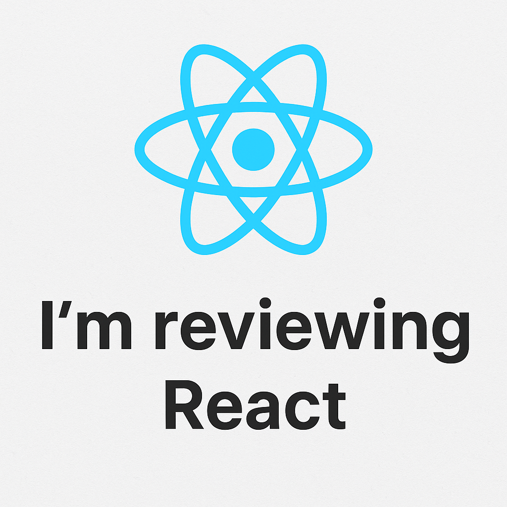

# Estou revisando React

Estou revisando **tudo sobre React** — do básico ao avançado.  
Aqui vou listar os tópicos que estou revisando e alguns links úteis.

## Tópicos que estou revisando
- Fundamentos: JSX, componentes, props e state
- Hooks: useState, useEffect, useContext, useRef, useReducer
- Gerenciamento de estado: Context API, Redux (básico)
- Ciclo de vida e efeitos colaterais
- Roteamento (React Router)
- Performance: memo, useMemo, useCallback, lazy + Suspense
- Testes: Jest + React Testing Library
- Build e deploy: Vite, bundlers, otimização
- Boas práticas: componentização, composição, acessibilidade (a11y)

## Observações
- Este repositório é meu espaço de estudos. Vou adicionar exercícios, exemplos e anotações conforme eu for revisando.
- Imagem no topo criada com ferramentas de geração de imagem para ilustrar a revisão.

---

Se quiser, eu posso:
- Gerar exemplos de código para cada tópico acima;
- Criar um índice automático do README com links para seções;
- Adicionar snippets de exercícios práticos.
